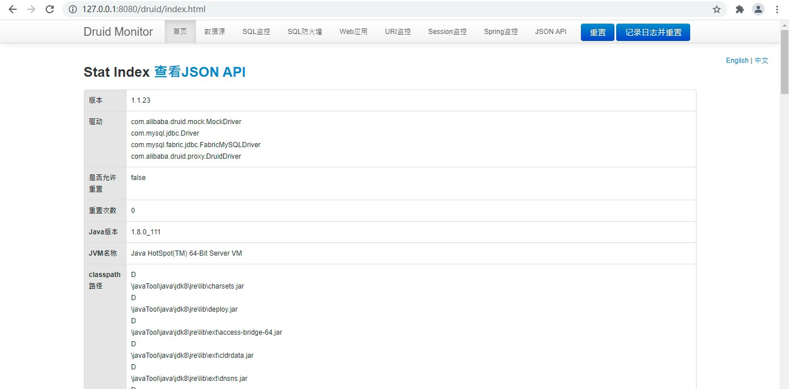
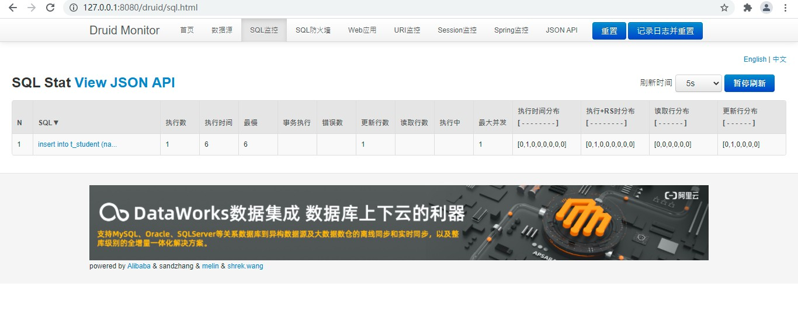
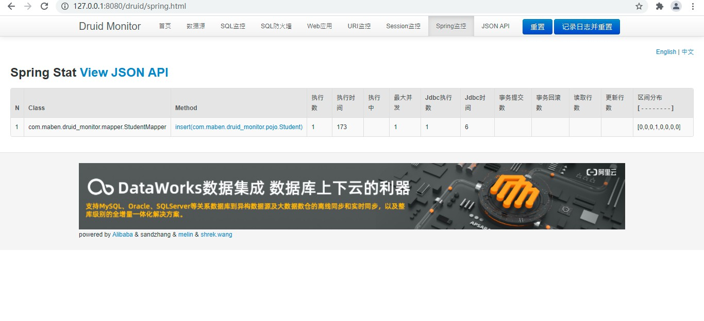

[TOC]

# Druid-monitor
## 官网
https://github.com/alibaba/druid/wiki

## db.sql

````sql
-- 创建数据库
create database test_m character set  utf8;
-- 使用该数据库
use test_m;
-- 创建表
CREATE TABLE `t_student` (
   `id` int(11) NOT NULL AUTO_INCREMENT,
   `name` varchar(255) NOT NULL,
   PRIMARY KEY (`id`),
   UNIQUE KEY `id` (`id`)
) ENGINE=InnoDB AUTO_INCREMENT=6 DEFAULT CHARSET=utf8
````

## pom.xml

````xml
<?xml version="1.0" encoding="UTF-8"?>
<project xmlns="http://maven.apache.org/POM/4.0.0"
         xmlns:xsi="http://www.w3.org/2001/XMLSchema-instance"
         xsi:schemaLocation="http://maven.apache.org/POM/4.0.0 http://maven.apache.org/xsd/maven-4.0.0.xsd">
    <modelVersion>4.0.0</modelVersion>

    <parent>
        <groupId>org.springframework.boot</groupId>
        <artifactId>spring-boot-starter-parent</artifactId>
        <version>2.0.5.RELEASE</version>
        <relativePath/>
    </parent>

    <groupId>com.maben</groupId>
    <artifactId>druid-monitor</artifactId>
    <version>1.0-SNAPSHOT</version>

    <properties>
        <project.build.sourceEncoding>UTF-8</project.build.sourceEncoding>
        <project.reporting.outputEncoding>UTF-8</project.reporting.outputEncoding>
        <java.version>1.8</java.version>
    </properties>

    <dependencies>
        <!--SpringBoot 的aop 模块-->
        <dependency>
            <groupId>org.springframework.boot</groupId>
            <artifactId>spring-boot-starter-aop</artifactId>
        </dependency>

        <!-- 阿里巴巴的druid数据源 -->
        <dependency>
            <groupId>com.alibaba</groupId>
            <artifactId>druid-spring-boot-starter</artifactId>
            <version>1.1.23</version>
        </dependency>
        <!-- mysql8 驱动-->
        <dependency>
            <groupId>mysql</groupId>
            <artifactId>mysql-connector-java</artifactId>
            <version>5.1.47</version>
            <scope>runtime</scope>
        </dependency>
        <!--
        mybatis，引入了 SpringBoot的 JDBC 模块，
        所以，默认是使用 hikari 作为数据源
        -->
        <dependency>
            <groupId>org.mybatis.spring.boot</groupId>
            <artifactId>mybatis-spring-boot-starter</artifactId>
            <version>2.1.3</version>
            <exclusions>
                <!-- 排除默认的 HikariCP 数据源 -->
                <exclusion>
                    <groupId>com.zaxxer</groupId>
                    <artifactId>HikariCP</artifactId>
                </exclusion>
            </exclusions>
        </dependency>

        <!--spring-web-->
        <dependency>
            <groupId>org.springframework.boot</groupId>
            <artifactId>spring-boot-starter-web</artifactId>
        </dependency>
        <!--测试依赖-->
        <dependency>
            <groupId>org.springframework.boot</groupId>
            <artifactId>spring-boot-starter-test</artifactId>
            <scope>test</scope>
        </dependency>

        <!--lombok-->
        <dependency>
            <groupId>org.projectlombok</groupId>
            <artifactId>lombok</artifactId>
            <version>1.18.10</version>
        </dependency>
        <!-- logback -->
        <dependency>
            <groupId>ch.qos.logback</groupId>
            <artifactId>logback-classic</artifactId>
            <version>1.2.3</version>
        </dependency>
    </dependencies>

</project>
````

## application.properties

````properties
##############################################################db config########################
spring.datasource.username=root
spring.datasource.password=zzb192171
spring.datasource.driver-class-name=com.mysql.jdbc.Driver
spring.datasource.url=jdbc:mysql://127.0.0.1:3306/test_m
spring.datasource.platform=mysql
#指定数据源类型
spring.datasource.type=com.alibaba.druid.pool.DruidDataSource
#连接池配置
spring.datasource.druid.initial-size=5
spring.datasource.druid.minIdle=10
spring.datasource.druid.max-active=20
spring.datasource.druid.max-wait=60000
spring.datasource.druid.time-between-eviction-runs-millis=2000
spring.datasource.druid.min-evictable-idle-time-millis=600000
spring.datasource.druid.max-evictable-idle-time-millis=900000
spring.datasource.druid.validationQuery=select 1
spring.datasource.druid.testWhileIdle=true
spring.datasource.druid.testOnBorrow=false
spring.datasource.druid.testOnReturn=false
spring.datasource.druid.poolPreparedStatements=true
spring.datasource.druid.maxOpenPreparedStatements=20
spring.datasource.druid.keepAlive=true


#############################spring监控，利用AOP对指定接口的执行时间、JDBC数进行记录##########################################
spring.datasource.druid.aop-patterns=com.maben.druid_monitor.mapper.*


############################ 启用内置过滤器（第一个 stat必须，否则监控不到SQL）###############################################
#stat是统计用的，wall是防火墙用的，logback说的是系统使用logback日志（也可以使用log4j2）
spring.datasource.druid.filters=stat,wall,logback


###########################自己配置监控统计拦截的filter#####################
####开启druid-datasource的状态监控####
spring.datasource.druid.filter.stat.enabled=true
spring.datasource.druid.filter.stat.db-type=mysql
# 开启慢sql监控，超过2s 就认为是慢sql，记录到日志中
spring.datasource.druid.filter.stat.log-slow-sql=true
spring.datasource.druid.filter.stat.slow-sql-millis=2000
####日志监控，使用slf4j 进行日志输出####
spring.datasource.druid.filter.slf4j.enabled=true
spring.datasource.druid.filter.slf4j.statement-log-error-enabled=true
spring.datasource.druid.filter.slf4j.statement-create-after-log-enabled=false
spring.datasource.druid.filter.slf4j.statement-close-after-log-enabled=false
spring.datasource.druid.filter.slf4j.result-set-open-after-log-enabled=false
spring.datasource.druid.filter.slf4j.result-set-close-after-log-enabled=false

########## 配置WebStatFilter，用于采集web关联监控的数据 ##########
spring.datasource.druid.web-stat-filter.enabled=true
spring.datasource.druid.web-stat-filter.url-pattern=/*
spring.datasource.druid.web-stat-filter.exclusions=*.js,*.gif,*.jpg,*.png,*.css,*.ico,/druid/*
spring.datasource.druid.web-stat-filter.session-stat-enable=true
spring.datasource.druid.web-stat-filter.session-stat-max-count=1000

########## 配置StatViewServlet（监控页面），用于展示Druid的统计信息 ##########
spring.datasource.druid.stat-view-servlet.enabled=true
spring.datasource.druid.stat-view-servlet.url-pattern=/druid/*
spring.datasource.druid.stat-view-servlet.reset-enable=false
spring.datasource.druid.stat-view-servlet.login-username=root
spring.datasource.druid.stat-view-servlet.login-password=123
spring.datasource.druid.stat-view-servlet.allow=127.0.0.1
spring.datasource.druid.stat-view-servlet.deny= 
````

## logback.xml

````xml
<?xml version="1.0" encoding="UTF-8"?>
<configuration
        xmlns="http://ch.qos.logback/xml/ns/logback"
        xmlns:xsi="http://www.w3.org/2001/XMLSchema-instance"
        xsi:schemaLocation="http://ch.qos.logback/xml/ns/logback logback.xsd">
    <appender name="STDOUT" class="ch.qos.logback.core.ConsoleAppender">
        <encoder>
            <!--%date{HH:mm:ss.SSS} %c -->
            <pattern>%date{HH:mm:ss.SSS} %c [%t] - %m%n</pattern>
        </encoder>
    </appender>

    <logger name="m" level="debug" additivity="false">
        <appender-ref ref="STDOUT"/>
    </logger>

    <root level="ERROR">
        <appender-ref ref="STDOUT"/>
    </root>
</configuration>
````

## 启动类

````java
package com.maben.druid_monitor;

import lombok.extern.slf4j.Slf4j;
import org.mybatis.spring.annotation.MapperScan;
import org.springframework.boot.SpringApplication;
import org.springframework.boot.autoconfigure.SpringBootApplication;

@Slf4j(topic = "m.MainApplication")
@SpringBootApplication
@MapperScan(value = "com.maben.druid_monitor.mapper")
public class MainApplication {
    public static void main(String[] args) {
        SpringApplication.run(MainApplication.class,args);
        log.info("****************启动成功*****************");
    }
}
````

## controller

````java
package com.maben.druid_monitor.controller;

import com.maben.druid_monitor.pojo.Student;
import com.maben.druid_monitor.service.StudentService;
import lombok.extern.slf4j.Slf4j;
import org.springframework.web.bind.annotation.PathVariable;
import org.springframework.web.bind.annotation.RequestMapping;
import org.springframework.web.bind.annotation.RestController;

import javax.annotation.Resource;
import java.util.Objects;

@Slf4j(topic = "m.StudentController")
@RestController
@RequestMapping("student")
public class StudentController {
    @Resource
    private StudentService studentService;

    @RequestMapping("save/{name}")
    public String save(@PathVariable String name) {
        if (Objects.isNull(name)) {
            return "success";
        }
        try {
            final Student student = new Student();
            student.setName(name);
            studentService.save(student);
            return "success";
        } catch (Exception e) {
            log.error("save student error:{}", e.getMessage());
            e.printStackTrace();
            return "error:" + e.getMessage();
        }
    }

}
````

## service

### interface

````java
package com.maben.druid_monitor.service;

import com.maben.druid_monitor.pojo.Student;

public interface StudentService {
    public void save(Student student)throws Exception;
}
````

### implements

````java
package com.maben.druid_monitor.service;

import com.maben.druid_monitor.mapper.StudentMapper;
import com.maben.druid_monitor.pojo.Student;
import org.springframework.stereotype.Service;

import javax.annotation.Resource;
import java.util.Objects;

@Service
public class StudentServiceImpl implements StudentService {
    @Resource
    private StudentMapper studentMapper;
    @Override
    public void save(Student student) throws Exception {
        if (Objects.isNull(student)){
            return;
        }
        studentMapper.insert(student);
    }
}
````

## mapper

````java
package com.maben.druid_monitor.mapper;

import com.maben.druid_monitor.pojo.Student;
import org.apache.ibatis.annotations.Insert;

public interface StudentMapper {
    @Insert(value = "insert into t_student (name) values (#{name})")
    void insert(Student student);
}
````

## pojo

````java
package com.maben.druid_monitor.pojo;

import lombok.Data;

@Data
public class Student {
    private Integer id;
    private String name;
}
````

## 页面相关

### 请求路径

http://127.0.0.1:8080/druid/index.html

### 首页




### SQL监控



### Spring监控


